1.2020-5-52 by congcong
## 关于项目
一个简单的前后端分离的Web图片分享和管理网站，前端主要使用了Vue框架，后端使用了SpringBoot框架。

本项目使用区块链来存储图片的关键信息，但是区块链部分部署在阿里云上，项目中只有访问图片的Hash处理和访问阿里云服务器的接口。

## 实现的功能
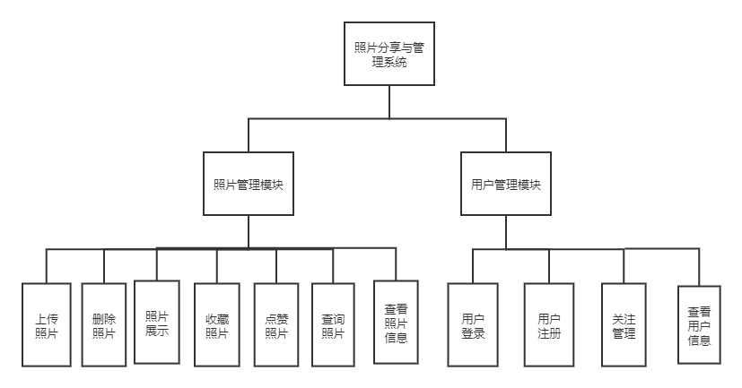

## 系统架构图与E-R图

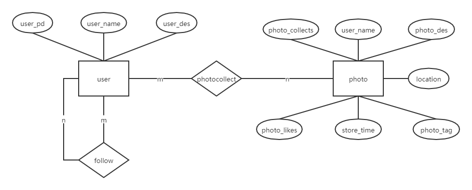
## 主要技术

前端
- Vue
- Nuxt  2.0.0
- Axios 0.19.2
- ELement-ui  2.4.11
  
后端
- Java 1.8
- SpringBoot  2.3.0
- MyBatis 2.1.2
- MySQL
  
## 截图
登录：
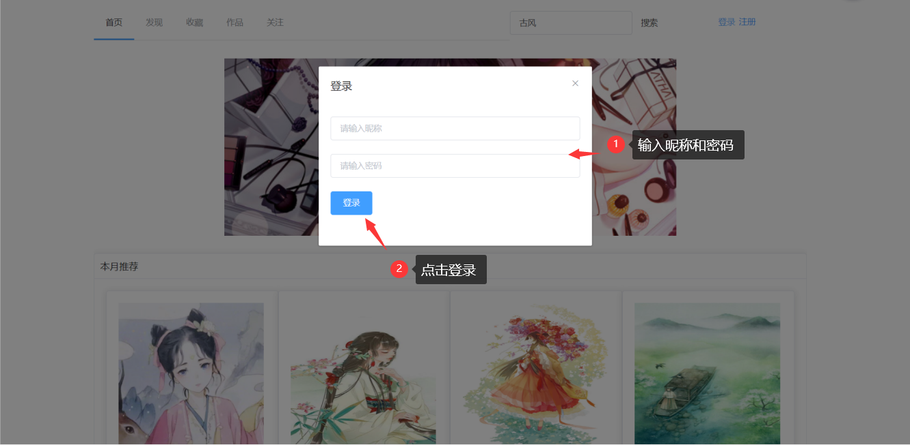

注册：
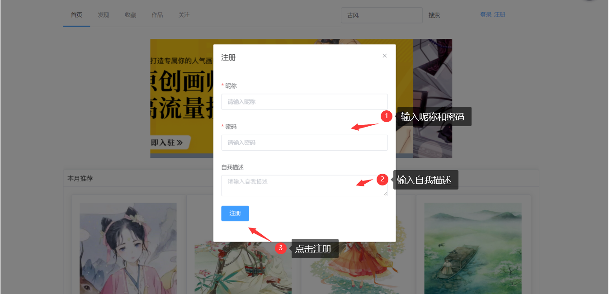

展示：
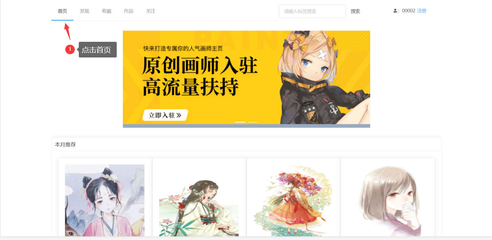

发现：
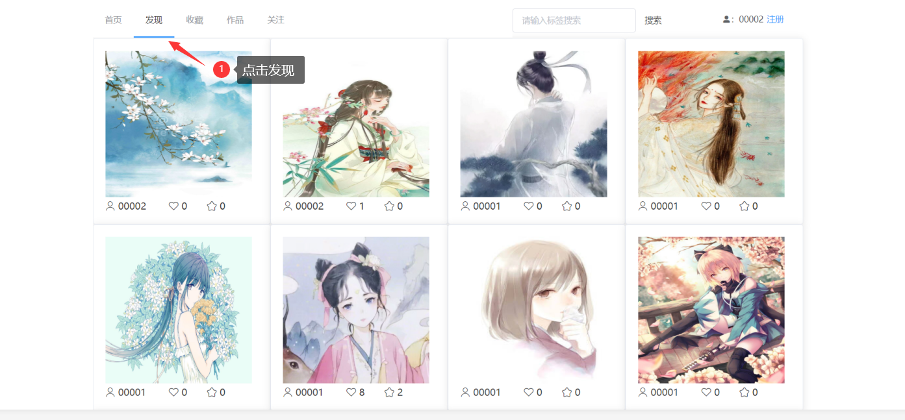

查询：
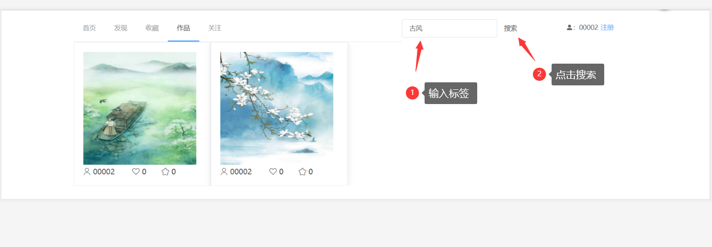

点赞：
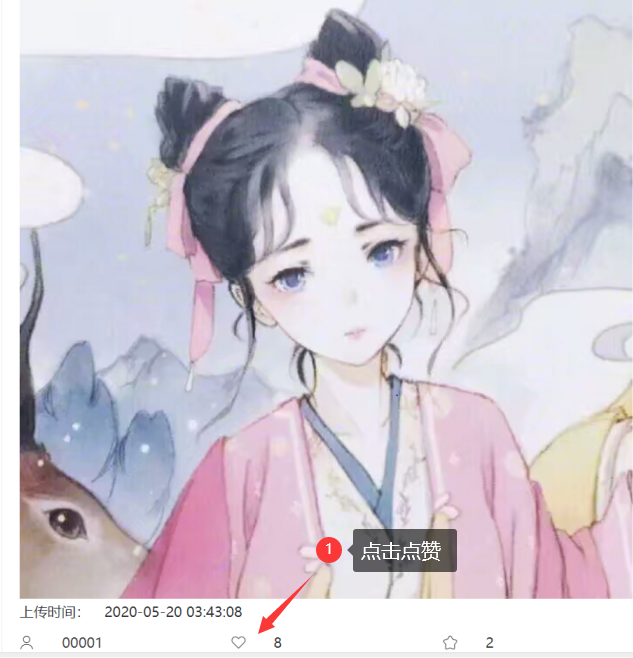

收藏：
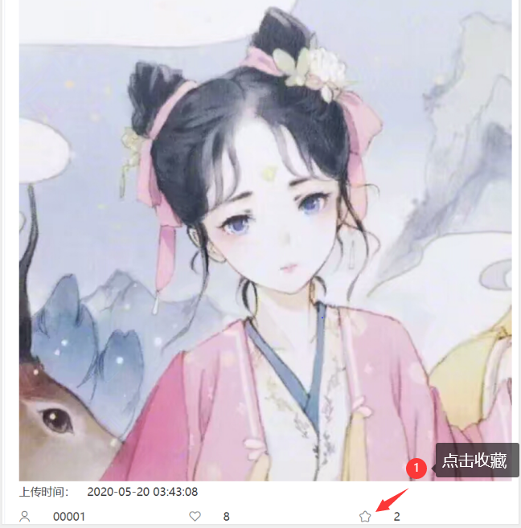

关注：
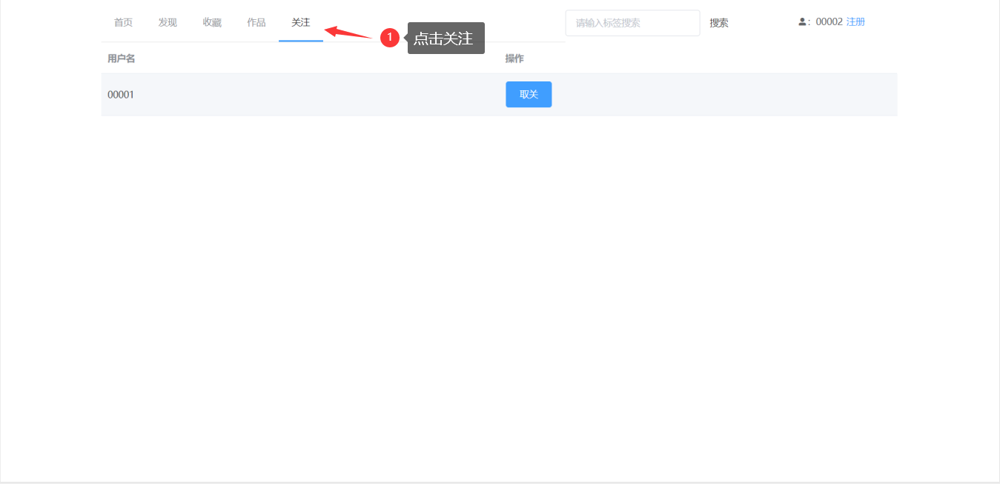

上传：
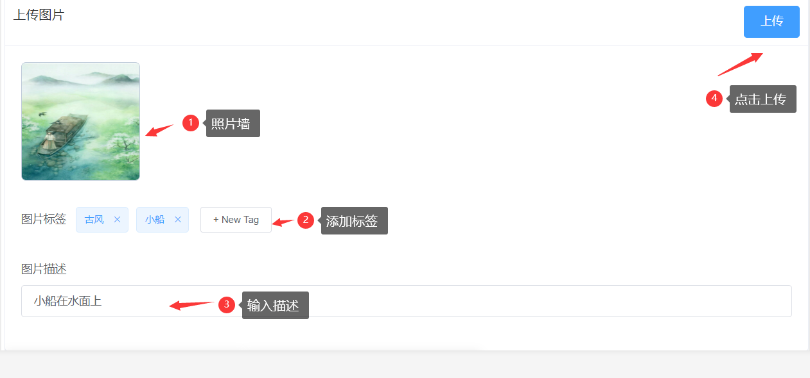

## 协议
[MIT](https://opensource.org/licenses/MIT)
